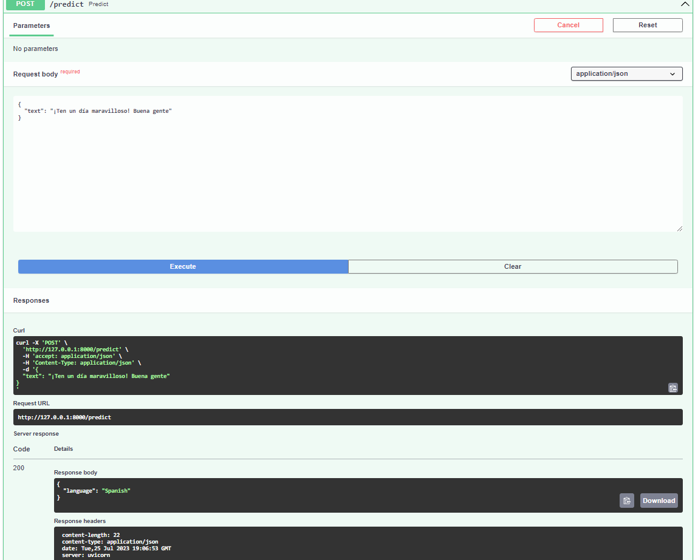

                        >>>>>>>>>>> A Langauge Detector Api <<<<<<<<<<<
                        
Description:
An API to detect language from the inserted string input that leverages deep learning. I created a web server with /prediction as a language detection route using FastAPI at the same fetch origin. Clients will submit their string input requests via the /predict route and retrieve the detection results via the same route. On the backend, I utilized async and a trained NLP model using the MultinomialNB model from naive_bayes and CountVectorizer from sklearn.feature_extraction and combined them using Pipeline to generate less error-prone model predictions, having saved the pretrained deep learning language model as (trained_pipeline-0.1.0.pkl), a pickle file, to perform the detection of the language. Which supports Arabic, Danish, Dutch, English, French, German, Greek, Hindi, Italian, Kannada, Malayalam, Portuguese, Russian, Spanish, Swedish, Tamil, and Turkish.

•	Root Directory:

•	Detection of the language from the inserted string: 

                       
                       
                        >>>>>>>>>>> A Langauge Translator Api <<<<<<<<<<<
                        
Description:
An API for translation that leverages deep learning. I created a web server with a /translate route and a /results route using FastAPI. Clients will submit their translation requests via the /translate route and retrieve the translation results via the /results route. The translations will be stored in a SQLite database on the server. On the backend, I utilized async and a Google-trained NLP-pretrained deep learning language model, "T5 Small," to perform the translation. Which supports German, French, English, and Romanian translations.

•	Provide the text to be translated along with the base and final/targeted language the text is to be translated into:

•	Generated desired translation from translation id from Sqlite database model: 

